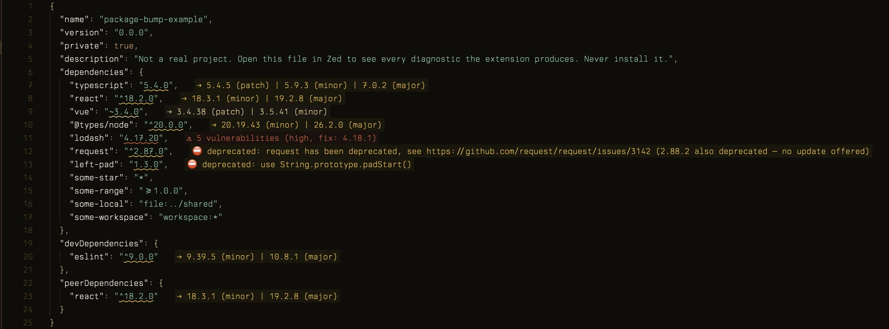
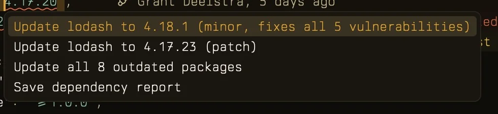
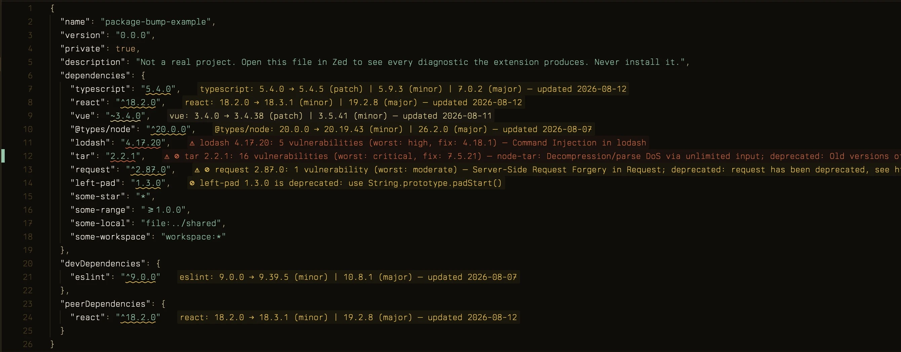
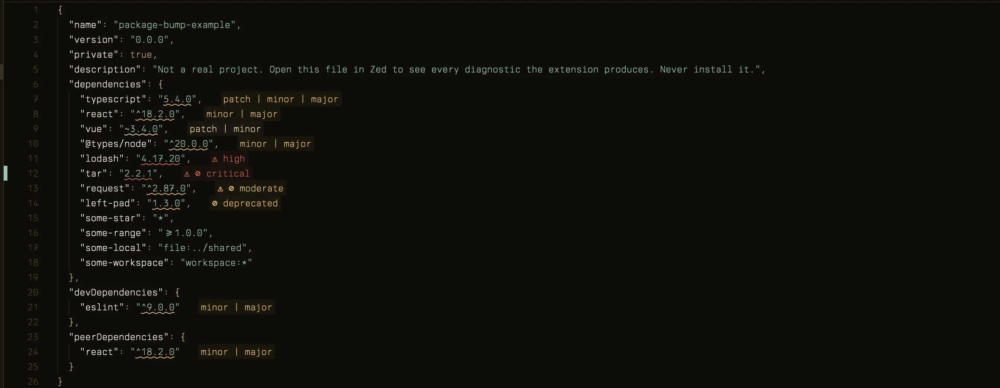

# Package Bump (Zed extension)

Flags outdated npm packages in `package.json` and adds code actions to bump the version numbers. It only edits the file — running `npm install` (or pnpm/yarn) afterwards is up to you.



## Updating packages

Outdated dependencies get underlined with the newest patch, minor, and major above your current version. Tiers that don't exist are left out:

```
→ 5.4.5 (patch) | 5.9.3 (minor) | 7.0.2 (major)
```

Severity follows the biggest update available, so you can tell at a glance how far behind a package is:

| biggest update | severity |
| -------------- | ----------- |
| major          | warning     |
| minor          | info        |
| patch          | hint        |

Put the cursor on a package line and press `cmd-.`:

- **Update `<name>` to `<version>` (patch/minor/major)** — one action per available tier, keeping your `^` or `~` prefix.
- **Update all N outdated packages** — rewrites every outdated version in the file at once.
- **Save dependency report** — writes the summary described in [Report](#report) instead of editing the file.



The newest version leads the menu. A tier that also clears a security advisory says so in its own label instead of adding a separate action.

## Vulnerabilities

Packages with known advisories get a second diagnostic, checked against the npm advisory database (the same data `npm audit` uses):

```
⚠ 5 vulnerabilities (high, fix: 4.18.1)
```

High and critical advisories show as errors, with a clickable link to the GitHub advisory. `fix:` names the smallest stable, non-deprecated version that clears every advisory, and `cmd-.` offers **Update `<name>` to `<version>` (fixes all N vulnerabilities)** — useful when the safe version is closer than latest.

This checks the version written in `package.json`, not what's actually installed in `node_modules`.

## Deprecated versions

Deprecated packages get a warning carrying the maintainer's message:

```
⊘ deprecated: request has been deprecated, see https://github.com/request/request/issues/3142
```

A deprecated version is never offered as an update target, including as a vulnerability fix. When everything newer is deprecated there's nothing to offer, so you get a note:

```
⊘ 1.3.0 (minor) deprecated — no update offered
```

If your own version is deprecated as well, that note joins the warning instead: `⊘ deprecated: <message> (1.3.0 also deprecated — no update offered)`.

A package that is both deprecated and vulnerable is one problem, not two, so it gets a single message carrying both markers and the advisory's severity — red for high and critical:

```
⚠ ⊘ 16 vulnerabilities (critical, fix: 7.5.21); deprecated: Old versions of tar are not supported…
```

## Report

**Save dependency report** in the `cmd-.` menu drops a plain-text summary next to the `package.json` and opens it — handy for pasting into a ticket or keeping a record of what's still behind. `examples/package.json` produces this in full:

```
package-bump report — examples/package.json
2026-08-18

OUTDATED (7)
  typescript      5.4.0    → 5.4.5 (patch) | 5.9.3 (minor) | 7.0.2 (major)
  react           18.2.0   → 18.3.1 (minor) | 19.2.8 (major)
  vue             3.4.0    → 3.4.38 (patch) | 3.5.41 (minor)
  @types/node     20.0.0   → 20.19.43 (minor) | 26.2.0 (major)
  lodash          4.17.20  → 4.17.23 (patch) | 4.18.1 (minor)
  tar             2.2.1    → 7.5.22 (major)
  eslint          9.0.0    → 9.39.5 (minor) | 10.8.1 (major)

VULNERABLE (3)
  lodash          4.17.20  5 vulnerabilities (high, fix: 4.18.1)
  tar             2.2.1    16 vulnerabilities (critical, fix: 7.5.21)
  request         2.87.0   1 vulnerability (moderate, no safe version)

DEPRECATED (3)
  tar             2.2.1    Old versions of tar are not supported, and contain widely publicized security vulnerabilities, which have been fixed in the current version. Please update. S…
  request         2.87.0   request has been deprecated, see https://github.com/request/request/issues/3142
  left-pad        1.3.0    use String.prototype.padStart()

NO UPDATE OFFERED (1)
  request         2.87.0   2.88.2 (minor) is deprecated

SKIPPED (4)
  some-star       *
  some-range      >=1.0.0
  some-local      file:../shared
  some-workspace  workspace:*
```

Empty sections are left out, and a manifest with nothing outstanding writes `Everything is up to date.` The file is rewritten each time the action runs, always at `package-bump-report.txt` beside the manifest, so it's worth adding to `.gitignore`. Contents come from the last diagnostics pass — no extra registry traffic.

A package listed in two sections is one row here, unlike the diagnostics, which flag every site. Skipped ranges appear only in the report; they carry no diagnostic.

## What's skipped

Version ranges the extension can't safely rewrite (`workspace:`, `file:`, `*`, `>=`, and anything else that isn't a plain version number) are left alone. So are manifests under `node_modules`, since npm overwrites those on the next install.

`examples/package.json` triggers every diagnostic at once — open it after installing to check the extension is working. Don't install its dependencies; they're deliberately broken.

## Install

Not on the Zed extension store yet, so it goes in as a dev extension.

You need `rustup` (Zed compiles the wasm part itself) and [pnpm](https://pnpm.io):

```sh
curl --proto '=https' --tlsv1.2 -sSf https://sh.rustup.rs | sh
npm install -g pnpm
```

Clone this repository, then build the language server:

```sh
pnpm --dir lsp install
pnpm --dir lsp build
```

In Zed, press `cmd-shift-x`, click **Install Dev Extension**, and pick the repository folder. Open a `package.json` to check it works.

If a project's `.zed/settings.json` sets a `language_servers` allowlist for JSON, add `"package-bump-lsp"` to it or the server won't start there.

## Settings

These go in Zed's `settings.json`, or in `.zed/settings.json` to apply to one project:

```jsonc
{
  "lsp": {
    "package-bump-lsp": {
      "settings": {
        "message_style": "full",
        "check_vulnerabilities": true
      }
    }
  }
}
```

`message_style` picks how much each diagnostic says:

| value                 | example                                                  |
| --------------------- | -------------------------------------------------------- |
| `"compact"` (default) | `→ 10.8.1 (major)`                                        |
| `"full"`              | `eslint: 9.39.4 → 10.8.1 (major) — updated 2026-08-12`    |
| `"level"`             | `patch \| minor \| major`                                 |

Vulnerability and deprecation messages shorten the same way and keep their `⚠` and `⊘` marker in every style. A vulnerability reads `⚠ 5 vulnerabilities (high)` in compact and `⚠ high` in level; a deprecation reads `⊘ deprecated: <message>` then `⊘ deprecated`.

`"full"` and `"level"` on the same file (`"compact"` is the screenshot at the top):





Zed only shows one message per line inline, so a package with both an update and a warning shows the more severe one. The diagnostics panel lists the rest.

`check_vulnerabilities` turns the security check off when set to `false` (default `true`).

## Development

`src/lib.rs` is a Rust wasm shim. It embeds the bundled server (`server/server.js`) at compile time via `include_str!`, writes it to the extension work dir on launch, and runs it with Zed's managed Node.

The server reads `dist-tags.latest` from the npm registry (abbreviated metadata, cached in memory for 5 minutes). All four dependency sections are scanned, and a package listed in more than one section is flagged in each. Prereleases compare per semver, so `^1.0.0-rc.1` is flagged once `1.0.0` ships.

Vulnerabilities come from the registry's bulk advisories endpoint (`/-/npm/v1/security/advisories/bulk`), a few POSTs per file, cached for an hour per `name@version`. Suggested fix versions are themselves audited before being shown — a candidate that turns out to carry its own advisories is skipped for the next clean one. The declared version (range prefix stripped) is what gets checked; lockfile-aware checking of actually-installed versions would be a separate feature.

After editing `lsp/src/`, rebuild with `pnpm --dir lsp build`, then Zed → Extensions → Package Bump → **Rebuild** and reopen the file. LSP logs are under `dev: open language server logs`.

Commit `server/server.js` together with `lsp/src` changes; CI rebuilds the bundle and fails if the committed copy is stale.
